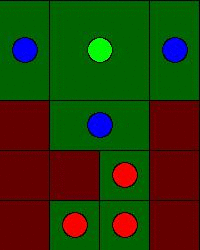
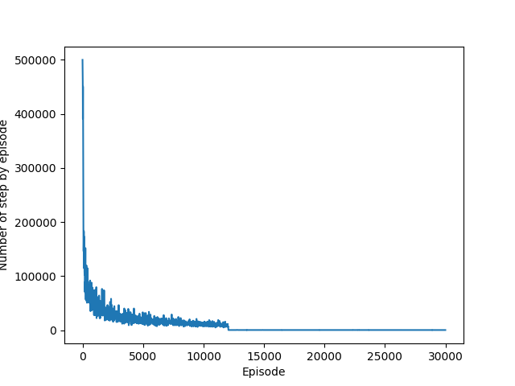

I use Q learning (or sarsa learning) to resolve the following puzzle:

The goal of the agent is to find how to move the pieces to lead the green piece to the terminal state (position y: 3, position x: 2)

This is the solution find by the agent in about 12000 episodes with Q learning:

Here is the learning curve:

